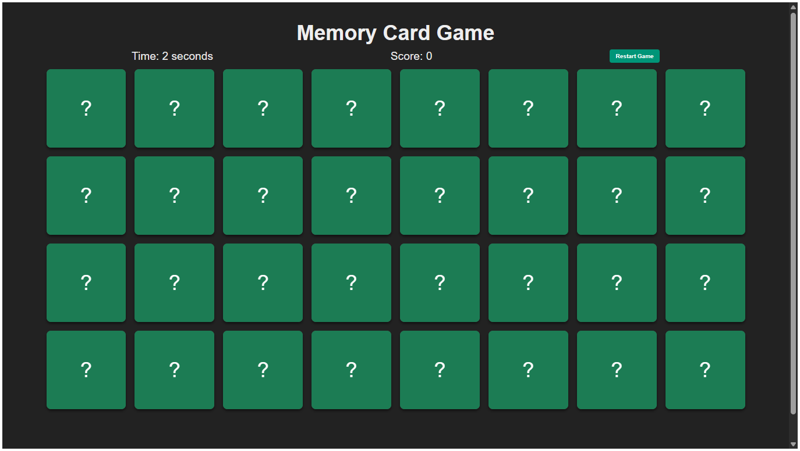
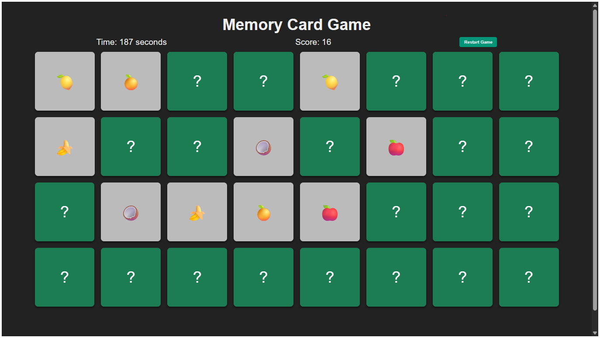

# Memory Card Game

  

## About the Game

This Memory Card Game is a classic matching pairs game built using HTML, CSS, and JavaScript with a fully responsive design. It challenges the player's memory by requiring them to find pairs of matching cards hidden face down on a grid. This game includes timing, score tracking, and a restart feature to enhance the experience.

Designed with a mobile-first approach, the game adapts smoothly to all screen sizes—from the smallest mobile phones to large desktop monitors and TV displays—ensuring a seamless experience on any device.

## How to Play

- Click on a card to flip and reveal its symbol.
- Click a second card to find the matching pair.
- If both cards match, they stay flipped face up.
- If the cards do not match, they flip back face down after a short delay.
- The goal is to match all pairs as quickly as possible and achieve the highest score.
- Score increases by 10 points for each match and decreases by 2 points for each mismatch.
- The timer starts automatically when the game begins.
- You can restart the game any time using the "Restart Game" button, which resets the timer and shuffles the cards.

## Game Rules and Regulations

- Only two cards can be flipped at any given time.
- Cards that have been matched remain face up and cannot be flipped back.
- The game finishes when all pairs have been correctly matched.
- Points and time taken are tracked and displayed during the game.
- The game is intended for solo play but can be adapted for multiplayer turn-based sessions.

## History of the Memory Card Game

The Memory Card Game, also known as Concentration or simply Memory, is a timeless card game known worldwide. Traditionally played with physical cards, the game was created to exercise and improve memory and concentration skills. Its origins date back to the 19th century, and it has since become a popular educational and recreational activity.

With the rise of digital technology, the game has transitioned into various digital formats including computer programs and mobile apps. It remains a simple yet effective tool for training cognitive abilities and is widely used in classrooms and therapy.

## Future of the Game

The Memory Card Game has vast potential for growth and innovation, such as:

- Adding multiplayer support with online matchmaking.
- Introducing new card themes and customizable decks.
- Implementing progressive difficulty levels with larger grids.
- Enhancing user experience with animations, sounds, and hints.
- Incorporating accessibility features for all players.
- Saving high scores and player profiles to a centralized backend.

## Developer Information

**Md Mohsin Haider**  
Web Developer & Software Engineer  
Email: mdmohsinhaider@example.com  
GitHub: [https://github.com/mdmohsinhaider](https://github.com/mdmohsinhaider)  
Portfolio: [https://mdmohsinhaider.github.io](https://mdmohsinhaider.github.io)  

Hosted live at:  
[https://mdmohsinhaider.github.io/Memory-Card-Game/](https://mdmohsinhaider.github.io/Memory-Card-Game/)

## Screenshots

- **Screenshot1.png** — The initial game board on a mobile screen.  
- **Screenshot2.png** — The game in action on a desktop view with some cards flipped.

---

Feel free to explore, play, and modify the project. Contributions and feedback are welcome!
